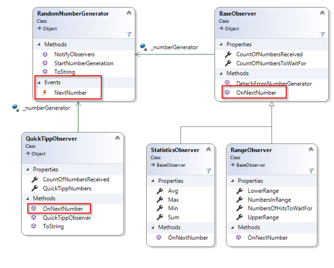

# NumberGenerator mit Delegate

## Lehrziele

* Events zur Implementierung des Observerpatterns
* Generische EventHandler

## Aufgabenstellung

Überarbeiten Sie die Lösung mit Delegates, indem Sie an Stelle der Delegatedefinition im Interface direkt in der Klasse `RandomNumberGenerator` ein Event `NextNumber` auf Basis eines generischen `EventHandlers<int>` definieren.

Die Funktionalität des Hauptprogramms bleibt unverändert.
Passen Sie die Unittests derart an, dass wieder alle Testfälle Sinn ergeben und von Ihrer Lösung bestanden werden.

## Klassendiagramm

